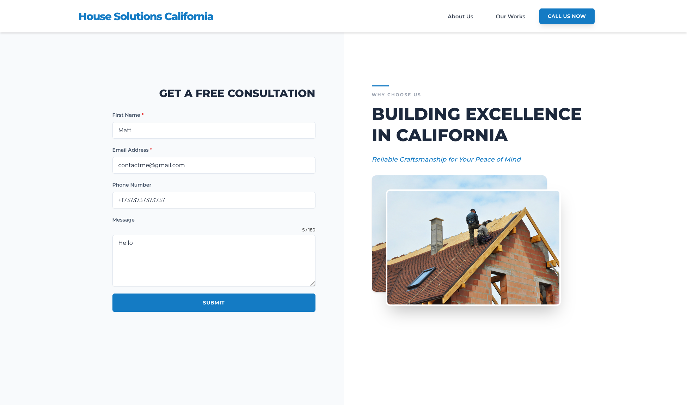
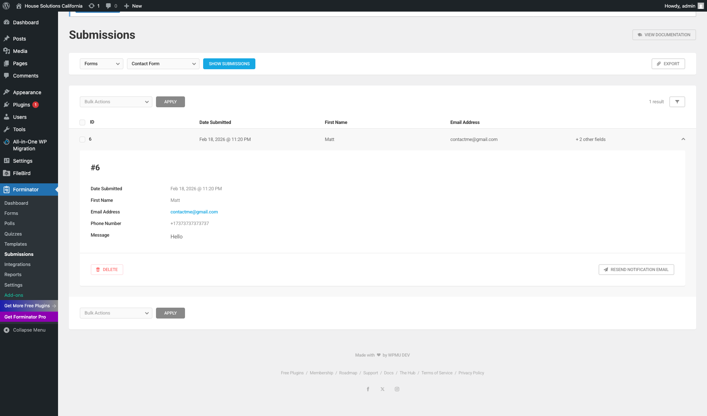

# 🏗️ Modern Construction Company Website

## 📖 Overview
A successful business needs a solid online presence. This project showcases a high-performance, conversion-focused website tailored specifically for construction companies and service-oriented businesses. 

Designed with both the user and the business owner in mind, it combines a sleek, professional aesthetic with powerful lead-generation tools. The architecture is fully flexible, meaning the website can easily scale and adapt as the client’s business grows.

## ✨ Key Features
* **Professional UI/UX:** A clean, trust-building design that highlights services and past projects.
* **Lead-Optimized Forms:** Streamlined contact forms designed to capture client inquiries effortlessly.
* **Custom Admin Panel:** An intuitive dashboard allowing business owners to manage content, track requests, and update their portfolio without any coding skills.
* **Fully Responsive:** Flawless performance across all desktop, tablet, and mobile devices.

## 🛠️ Tech Stack
> **Note:** Here you can list the technologies you used (e.g., React, Node.js, Tailwind CSS, etc.)
* **Frontend:** HTML CSS JS
* **Backend:** PHP
* **Engine:** Engine: WordPress (CMS)
* **Design:** Figma

## 📸 Project Showcase

### 🖥️ Main Page
*A strong first impression that highlights the company's expertise and core services.*
 

### 📝 Contact & Lead Form
*Designed for high conversion, making it easy for potential clients to request a quote.*
 

### 🎛️ Admin Dashboard
*A behind-the-scenes look at the easy-to-use content management system.*
 

